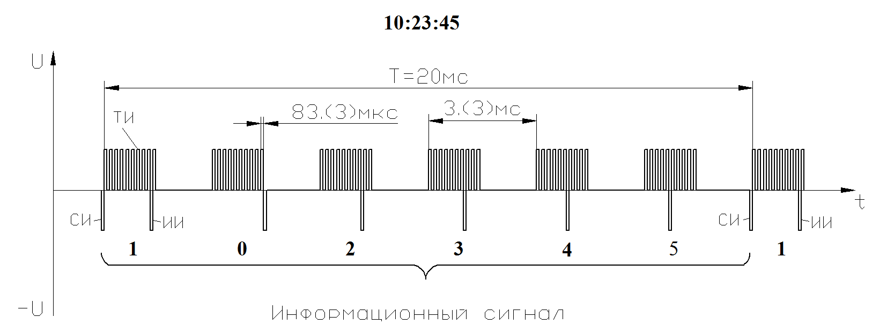
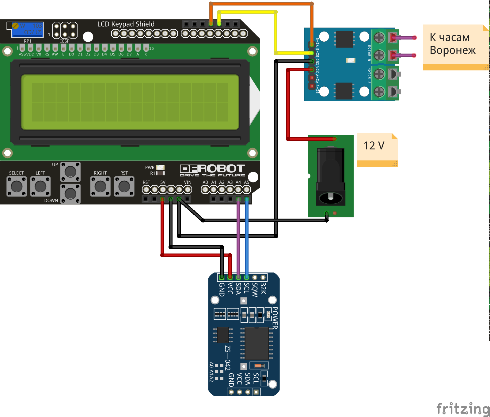
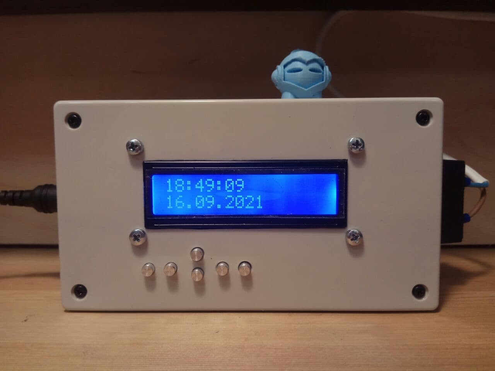

# Контроллер управления вторичными часами, типа "Воронеж"

Данный контроллер может быть использован и современными вторичными часами, типа Вторичные часы цифровые ВЧЦ-100, ВЧЦ-160.

<b>Внешний вид.</b>

  
## Контроллер вторичных часов "Воронеж".

Контроллер полностью реализует функциональность оригинальных часов, и тайминги сигналов, согласно документации и реально снятым сигналам.

<b>Cтруктурная схема информационного сигнала.</b>

  
  
  
## Контроллер собран на базе:
- Arduino uno
- Модуль дисплея LCD Keypad Shield
- Модуль часов реального времени ds1307
- Модуль управления двигателем L9110S (позднее заменён на микросхему IR4427)
  
  

<b>Блок-схема.</b>

  
  
Клавиатура позволяет устанавливать дату и время. В промежуток между 25 и 35 секундами на часах отображается текущая дата. 

<b>Внешний вид контроллера.</b>

Контроллер собран в стандартном корпусе на макетной плате, питается от блока питания 12 В постоянного тока.

